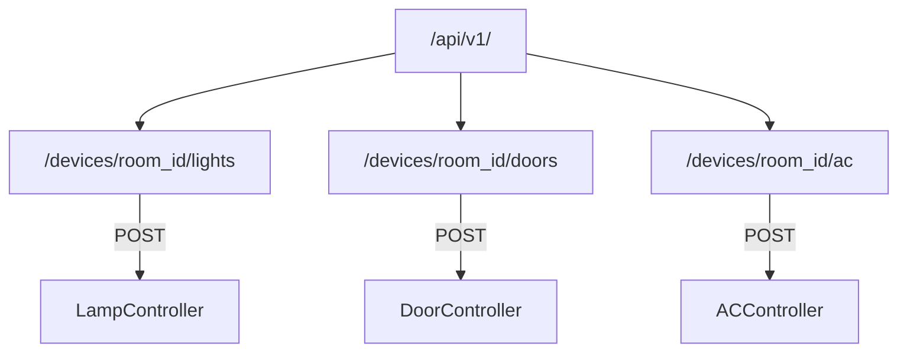
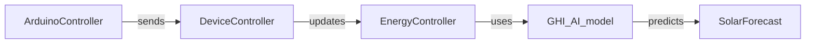
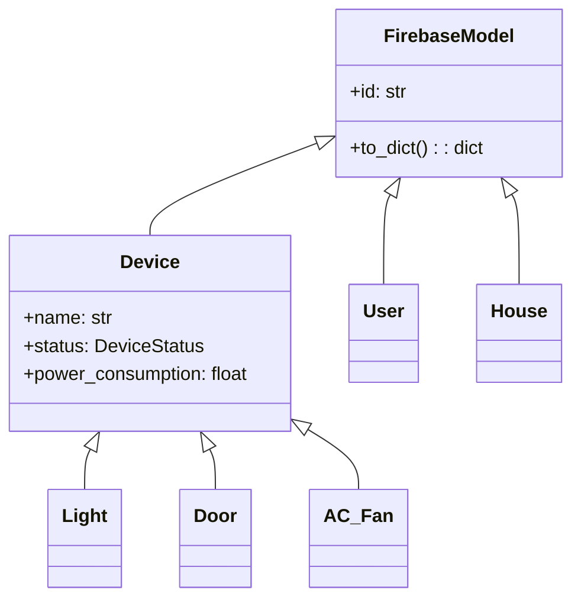

# Application Core Module Documentation (`app/`)

## Folder Structure
```
app/
├── api/                  # REST API endpoints
│   ├── __init__.py       # API blueprint registration
│   └── routes.py         # Device control routes
├── controller/           # Business logic controllers
│   ├── arduino_controler.py
│   ├── device_controller.py
│   ├── energy_controller.py
│   └── GHI_AI_model/     # Solar forecasting
│       ├── ghi_fun.py
│       └── Training.ipynb
├── models/               # Data models and Firebase integration
│   ├── base.py
│   ├── device.py
│   ├── room.py
│   ├── user.py
│   └── database_init.py
├── __init__.py           # Application factory and core config
├── db_init.py            # Firebase initialization
└── arduino_data_example.json  # Sample sensor data format
```

## 1. Core Application Setup (`__init__.py`)

### Key Components:
```python
# Configuration Classes
class Config:
    """Base configuration for all environments"""
    SECRET_KEY = 'my-secret-key'
    FIREBASE_CREDENTIALS_PATH = './credentials.json'

class DevelopmentConfig(Config):
    """Development-specific settings"""
    DEBUG = True

# Application Factory
def create_app(config_class=Config):
    """Initializes Flask application with:
    - CORS support
    - WebSocket integration
    - API routes
    - Background Arduino monitoring
    """
    app = Flask(__name__)
    app.config.from_object(config_class)
    # Initialization logic here...
    return app
```

### WebSocket Handlers:
| Event | Handler | Description |
|-------|---------|-------------|
| connect | `handle_connect` | Starts Arduino monitoring thread |
| command | `send_command` | Forwards device commands to Arduino |
| forecast | `send_forecast` | Triggers solar radiation predictions |

---

## 2. API Layer (`api/`)

### Route Structure:


### Route Mapping:
| Endpoint | Controller Method | HTTP Method |
|----------|-------------------|-------------|
| `/lights` | `LampController.lamp_on()` | POST |
| `/doors` | `DoorController.open_door()` | POST |
| `/ac` | `AC_Fan.activate_ac_fan()` | POST |

---

## 3. Controller Layer (`controller/`)

### Component Relationships:


### Key Controllers:
1. **ArduinoController**
   - Manages serial communication
   - Handles message encoding/decoding
   - Runs background monitoring thread

2. **DevicesController**
   - Nested controller classes per device type
   - Maps device actions to Arduino commands

3. **EnergyManagementSystem**
   - Implements priority-based energy distribution
   - Integrates solar forecasts from AI model

---

## 4. Data Models (`models/`)

### Core Model Structure:


### Firebase Integration:
- `FirebaseManager` singleton handles DB operations
- Automatic document ID management
- Type conversion for Firestore compatibility

---

## 5. Database Initialization (`db_init.py`)

### Firebase Setup Flow:
```python
def init_firebase(app: Flask) -> None:
    """Initializes Firebase connection with:
    - Environment-specific credentials
    - Error handling for invalid config
    - Singleton pattern enforcement
    """
    cred = credentials.Certificate(cred_path)
    firebase_admin.initialize_app(cred)
```

---

## 6. Data Format Reference (`arduino_data_example.json`)

### Sensor Data Structure:
```json
{
    "house_id": "house1",
    "timestamp": "ISO8601",
    "rooms": {
        "room1": {
            "temperature": 22.5,
            "devices": {
                "light1": {
                    "status": "ACTIVE",
                    "duration_left": 30
                }
            }
        }
    },
    "solar_system": {
        "battery1": {
            "charge_percent": 80
        }
    }
}
```

### Field Descriptions:
| Path | Type | Description |
|------|------|-------------|
| `rooms.{room}.devices` | Object | Per-device status |
| `solar_system.battery1.charge_percent` | Float | Battery charge level |
| `timestamp` | String | Event time in ISO format |
