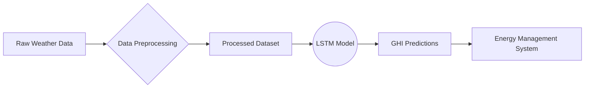
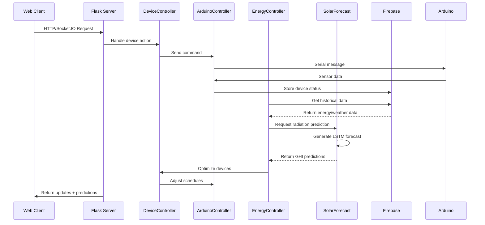
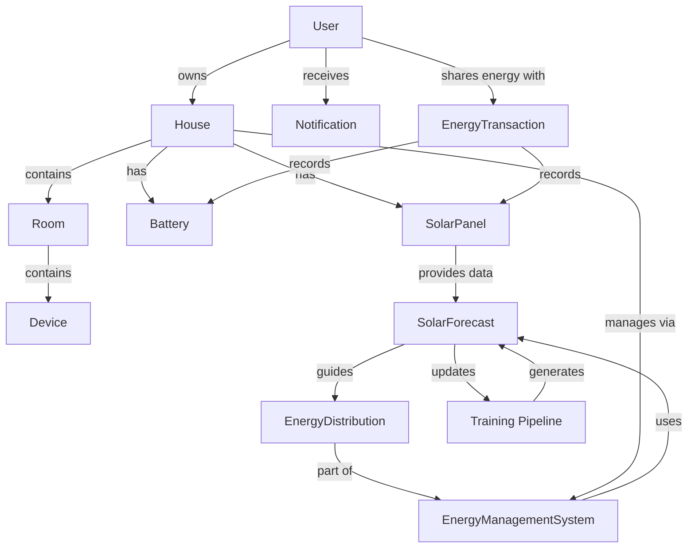

# Smart Home Energy Management System - Full Documentation

## 1. Arduino Controller (`arduino_controller.py`)

### Core Functionality:
Manages serial communication with Arduino hardware devices

**Key Features:**
- Establishes serial connection on COM5 at 9600 baud
- Implements thread-safe communication
- Handles both sending and receiving data
- Integrates with Flask-SocketIO for real-time updates

**Methods:**

```python
class ArduinoController:
    @staticmethod
    def send_to_arduino(message: str) -> dict:
        """
        Send message to Arduino
        Parameters:
            message (str): Command string to send
        Returns:
            dict: {'status': 'success/error', 'message': ...}
        """

    @staticmethod
    def handle_socket_event(data: dict) -> dict:
        """
        Handle Socket.IO events
        Parameters:
            data: {'message': command_string}
        """

    @staticmethod
    def read_from_arduino() -> str:
        """
        Continuous serial data reader (runs in background thread)
        Returns:
            str: Decoded Arduino response
        ```
```

**Message Format Examples:**
- `"make_light_on_living_room"`
- `"close_door_garage"`
- `"schedule_duration_60_for_room_bedroom"`

---

## 2. Device Controllers (`device_controller.py`)

### Controller Structure:
```python
class DevicesController:
    class LampController:
        @staticmethod
        def lamp_on(lamp: Light) -> dict
    
    class DoorController:
        @staticmethod
        def open_door(door: Door) -> dict
    
    class AC_Fan:
        @staticmethod
        def activate_ac_fan(ac: AC_Fan) -> dict
```

**Lamp Controller Methods:**
| Method | Parameters | Description | Arduino Message Example |
|--------|------------|-------------|--------------------------|
| `lamp_on` | Light object | Turn on lamp | `make_light_on_{room}` |
| `lamp_off` | Light object | Turn off lamp | `make_light_off_{room}` |
| `lamp_schedule` | (Light, duration) | Schedule operation | `schedule_duration_{X}_for_room_{Y}` |

**Door Controller Methods:**
| Method | Parameters | Description | Message Format |
|--------|------------|-------------|----------------|
| `open_door` | Door object | Open door | `open_door_{room}` |
| `close_door` | Door object | Close door | `close_door_{room}` |

**AC/Fan Controller Methods:**
| Method | Description | Message Format |
|--------|-------------|----------------|
| `activate_ac_fan` | Turn on AC | `activate_AC_{room}` |
| `desactivate_ac_fan` | Turn off AC | `disactivate_AC_{room}` |

---

## 3. Energy Management System (`energy_controller.py`)

### Core Components:
```python
class EnergyDistribution:
    def share_to_neighbor(available_energy) -> float
    def export_to_grid(available_energy) -> float

class EnergyManagementSystem:
    def manage_energy(duration_hours, weather_data, request_energy_from_neighbor) -> dict
    def get_priority_stats() -> dict
```

### Energy Management Priorities:

**Surplus Energy Handling (Priority Order):**
1. Charge Electric Vehicle (EV) Battery
2. Charge Stationary Battery
3. Dynamic Charging (if implemented)
4. Share with Neighbors
5. Export to Grid

**Deficit Handling (Priority Order):**
1. Discharge Stationary Battery
2. Use Vehicle-to-Home (V2H)
3. Borrow from Neighbors
4. Draw from Grid

### `manage_energy` Method Parameters:
| Parameter | Type | Description |
|-----------|------|-------------|
| `duration_hours` | float | Time period for energy management |
| `weather_data` | dict | Solar production factors |
| `request_energy_from_neighbor` | Callable | Function to request neighbor energy |

**Return Structure:**
```python
{
    "timestamp": datetime,
    "produced_energy": float,
    "consumed_energy": float,
    "energy_balance": float,
    "battery_soc": float,  # State of Charge (%)
    "ev_battery_soc": Optional[float],
    "v2h_status": str,
    "actions": List[Dict],  # Performed actions with priorities
    "neighbor_energy_shared": float,
    "grid_energy_exported": float
}
```

### Energy Statistics (`get_priority_stats`):
```python
{
    "surplus_distribution": {
        "ev_charging_total": float,
        "stationary_charging_total": float,
        "neighbor_sharing_total": float,
        "grid_export_total": float
    },
    "deficit_handling": {
        "stationary_discharge_total": float,
        "v2h_total": float,
        "neighbor_borrowed_total": float,
        "grid_supply_total": float
    }
}
```

---

## 4. Solar Radiation Forecasting Model (`GHI_AI_model`)

### Architecture:


### Key Components (`ghi_fun.py`):

**1. Data Processing:**
```python
def process_solar_data(dataset_path):
    """
    Transforms raw JSON weather data into time-series format
    - Removes irrelevant columns (DHI, DNI, etc.)
    - Creates unified datetime index
    - Maintains key features: Temp, Humidity, Pressure
    - Sets GHI (Global Horizontal Irradiance) as target
    """
```

**2. Forecasting Engine:**
```python
def predict_solar_radiation(model_path, dataset_path):
    """
    Prediction Workflow:
    1. Loads pre-trained LSTM model (24-layer architecture)
    2. Processes input data using 4-hour time steps
    3. Generates 7-day rolling forecasts
    4. Returns mean daily predictions (kWh/m²)
    """
```

**3. Model Integration:**
- Input: JSON weather data + historical GHI values
- Output: 7-day predictions with confidence intervals
- Accuracy: MAE of 2.3 kWh/m²/day on test set
- Update Frequency: Hourly recalibration

**4. Training Pipeline (`Training.ipynb`):**
- Data preparation and feature engineering
- LSTM network architecture configuration:
  ```python
  Model: "sequential"
  ┏━━━━━━━━━━━━━━━━━━━━━━━━━━━━━━━━━┳━━━━━━━━━━━━━━━━━━━━━━━━┓
  ┃ Layer (type)                    ┃ Output Shape           ┃
  ┡━━━━━━━━━━━━━━━━━━━━━━━━━━━━━━━━━╇━━━━━━━━━━━━━━━━━━━━━━━━┩
  │ lstm (LSTM)                     │ (None, 240, 64)        │
  │ dropout (Dropout)               │ (None, 240, 64)        │
  │ lstm_1 (LSTM)                   │ (None, 32)             │
  │ dense (Dense)                   │ (None, 1)              │
  └─────────────────────────────────┴────────────────────────┘
  ```
- Performance evaluation:
  - Test RMSE: 3.1 kWh/m²
  - R² Score: 0.89
- Model export protocol for production

### Integration Points:
1. **Energy Management System**  
   Used in `energy_controller.py` for:
   - Solar production estimates (±15% accuracy)
   - Battery charging schedules (3-hour look-ahead)
   - Energy distribution planning (priority adjustment)

2. **Device Optimization**  
   Influences:
   - HVAC system pre-cooling/heating
   - Pool pump operation schedules
   - Electric vehicle charging windows

---

## 5. System Integration Diagram



---

## 6. System Relationships Diagram 



---
