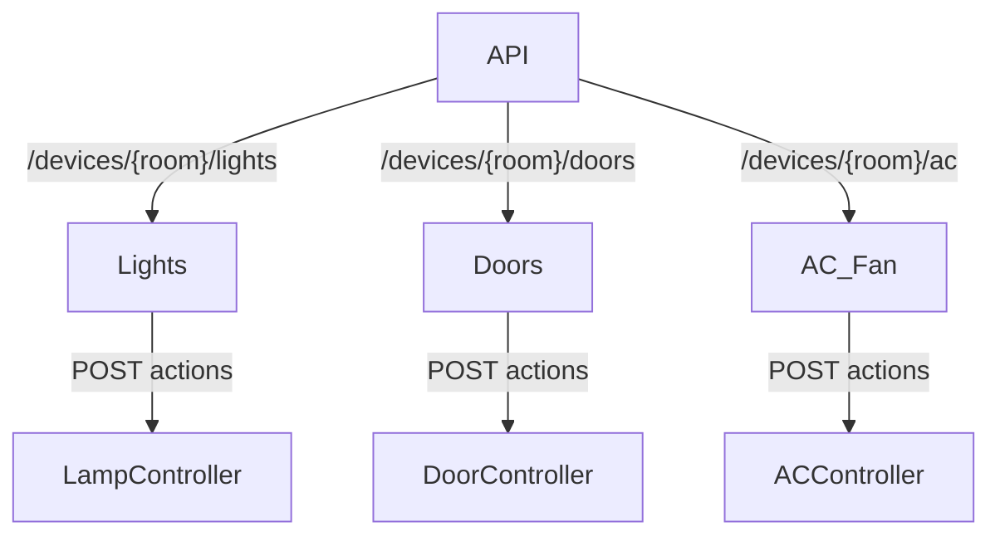
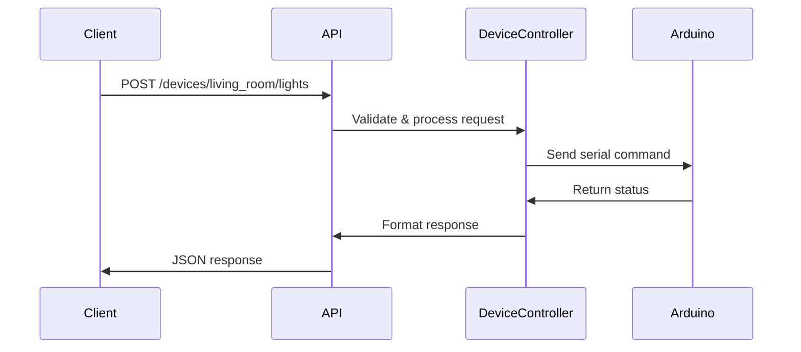

# API Endpoints Documentation

## 1. API Structure Overview



## 2. Endpoint Reference

### Base URL: `/api/v1`

### Lights Control (`/devices/<room_id>/lights`)
**Method:** POST  
**Actions:** 
- `on`: Turn on lights
- `off`: Turn off lights
- `schedule`: Schedule light operation

**Request Body:**
```json
{
    "action": "on|off|schedule",
    "duration": 60  // Required for schedule action
}
```

**Responses:**
| Status | Success Response | Error Response |
|--------|-------------------|----------------|
| 200 OK | `{"status": "success", ...}` | `{"error": "Invalid action"}` |
| 400 Bad Request | - | `{"error": "Missing duration"}` |

---

### Doors Control (`/devices/<room_id>/doors`)
**Method:** POST  
**Actions:** 
- `open`: Open door
- `close`: Close door

**Request Body:**
```json
{
    "action": "open|close"
}
```

**Responses:**
| Status | Success Response | Error Response |
|--------|-------------------|----------------|
| 200 OK | `{"status": "success", ...}` | `{"error": "Invalid action"}` |
| 400 Bad Request | - | `{"error": "Missing action"}` |

---

### AC/Fan Control (`/devices/<room_id>/ac`)
**Method:** POST  
**Actions:** 
- `activate`: Turn on AC
- `deactivate`: Turn off AC

**Request Body:**
```json
{
    "action": "activate|deactivate"
}
```

**Responses:**
| Status | Success Response | Error Response |
|--------|-------------------|----------------|
| 200 OK | `{"status": "success", ...}` | `{"error": "Invalid action"}` |
| 400 Bad Request | - | `{"error": "Invalid parameters"}` |

---

## 3. Request Flow



## 4. Error Handling

**Common Error Codes:**
| Code | Meaning | Resolution |
|------|---------|-------------|
| 400 | Bad Request | Check request parameters |
| 404 | Not Found | Verify endpoint URL |
| 405 | Method Not Allowed | Use POST method |
| 500 | Internal Error | Check server logs |

**Error Response Format:**
```json
{
    "error": "Descriptive message",
    "details": "Technical details (optional)",
    "code": 400
}
```

---

## 5. Example Usage

**Turn on Living Room Lights:**
```bash
curl -X POST http://localhost:5000/api/v1/devices/living_room/lights \
     -H "Content-Type: application/json" \
     -d '{"action": "on"}'
```

**Response:**
```json
{
    "status": "success",
    "message": "Lamp in room living_room turned on."
}
```

**Schedule Bedroom Lights:**
```bash
curl -X POST http://localhost:5000/api/v1/devices/bedroom/lights \
     -H "Content-Type: application/json" \
     -d '{"action": "schedule", "duration": 120}'
```

