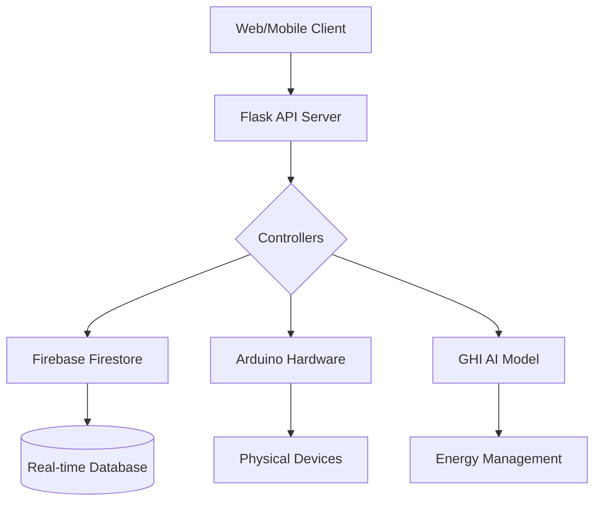
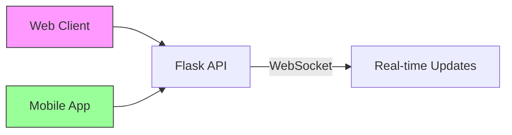
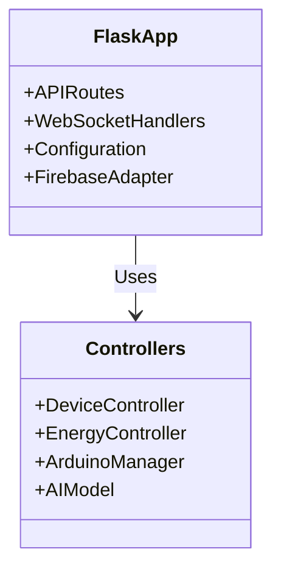
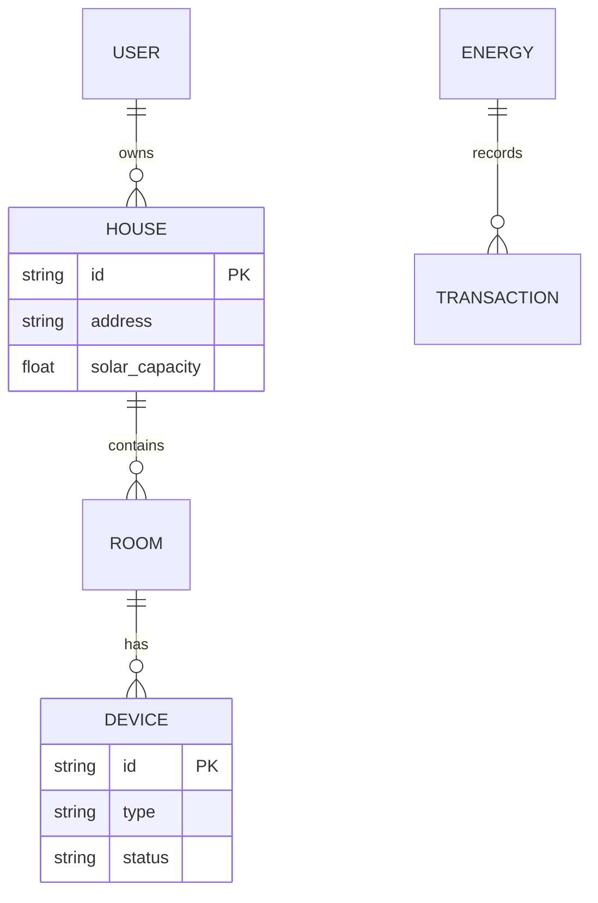
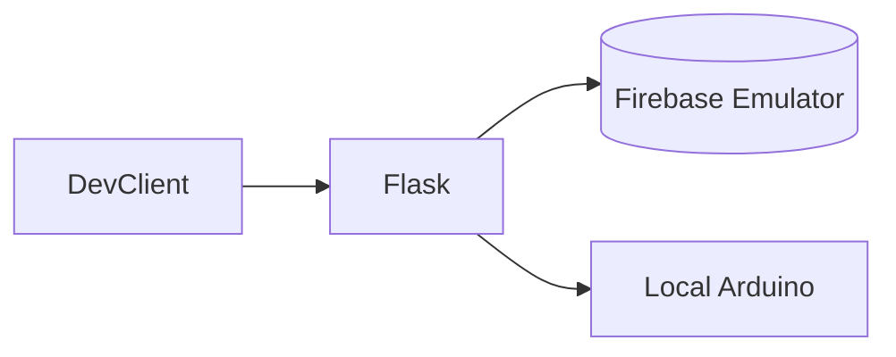
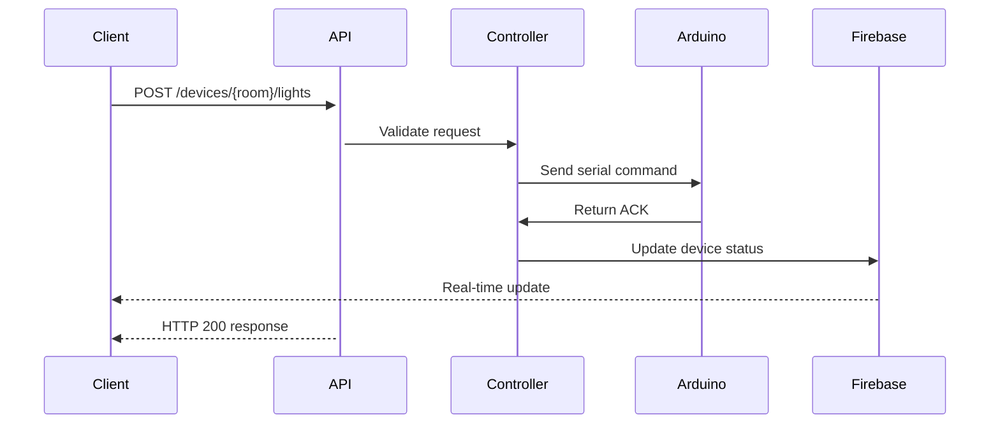
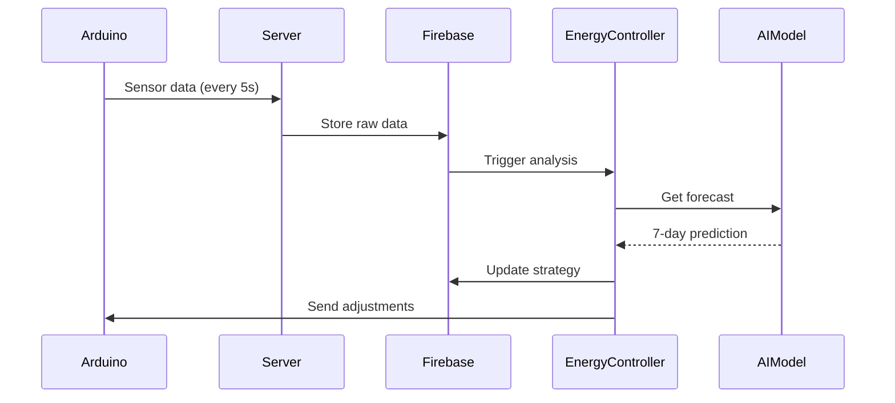

# System Architecture Documentation

## High-Level Overview


## 1. Component Architecture

### 1.1 Presentation Layer


- **Web Client**: React-based dashboard
- **Mobile App**: Native iOS/Android applications
- **WebSocket**: Bi-directional communication channel

### 1.2 Application Layer


### 1.3 Data Layer


## 2 Development Setup



## 3. Core Flows

### 3.1 Device Control Flow


### 3.2 Energy Management Flow


## 4. Key Architectural Decisions

1. **Real-time First Design**
   - WebSocket for instant updates
   - Firebase listener for DB changes
   - 5-second sensor polling cycle

2. **Modular Controller System**
   ```python
   class DeviceController(ABC):
       @abstractmethod
       def handle_command(self, command): pass
   
   class LightController(DeviceController):
       def handle_command(self, cmd):
           # Implementation specific to lights
   ```

3. **AI/ML Integration**
   - LSTM model for solar predictions
   - Separate model-serving thread
   - Daily retraining pipeline

4. **Security Layers**
   ```mermaid
   graph TD
       Request --> Auth[OAuth2 Authentication]
       Auth --> RateLimit[Rate Limiting]
       RateLimit --> Validation[Input Validation]
       Validation --> Controller
   ```

## 5. Scalability Considerations

| Component        | Scaling Strategy                | Tools/Techniques               |
|------------------|---------------------------------|--------------------------------|
| API Server       | Horizontal scaling              | Kubernetes, Gunicorn workers   |
| Database         | Sharding                        | Firebase regional deployments  |
| AI Model         | Batch processing                | TF Serving, GPU acceleration   |
| Arduino Network  | Edge computing                  | MQTT message broker            |

## 6. Technology Stack

| Layer            | Technologies                    |
|------------------|---------------------------------|
| Frontend         | React, Flutter, WebSocket       |
| Backend          | Flask, Firebase, Socket.IO      |
| Hardware         | Arduino UNO, ESP32 sensors      |
| AI/ML            | TensorFlow, Keras, Pandas       |
