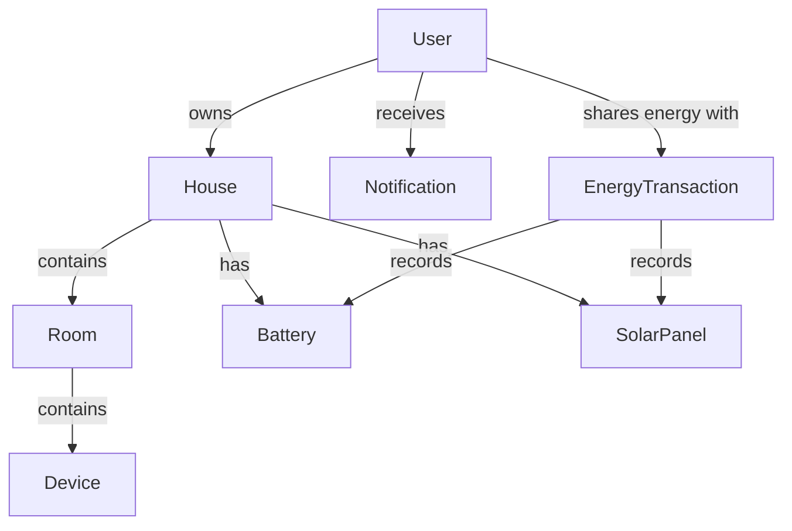

# Smart Home Energy Management System - Models Documentation

## 1. Base Models and Utilities (`base.py`)

### Core Components:
```python
class EnergyTransactionType(str, Enum):
    SOLAR_TO_BATTERY = "solar_to_battery"
    NEIGHBOR_TO_HOUSE = "neighbor_to_house"
    GRID_TO_HOUSE = "grid_to_house"
    CAR_TO_HOUSE = "car_to_house"

class DeviceStatus(str, Enum):
    ACTIVE = "active"
    INACTIVE = "inactive"
    MAINTENANCE = "maintenance"
    ERROR = "error"

class DeviceType(str, Enum):
    LIGHT = "light"
    WINDOW = "window"
    DOOR = "door"
    CLEANING_ROBOT = "cleaning_robot"
    MAGNETIC_LOCK = "magnetic_lock"
    GARAGE_DOOR = "garage_door"
```

### FirebaseModel Class
Base class for all data models with Firestore integration

**Attributes:**
- `id`: Document ID (auto-generated by Firestore)

**Methods:**
```python
def to_dict(self) -> dict:
    """Convert model to Firestore-compatible dictionary"""
    # Handles Enum, datetime, and nested model conversions
```

### FirebaseManager Class (Singleton)
Manages Firebase connection and database operations

**Initialization:**
- Loads credentials from environment variable `FIREBASE_CREDENTIALS_PATH`
- Initializes Firestore client

**Key Methods:**
```python
def init_database(self):
    """Initialize empty collections in Firestore"""

def create_document(collection, data):
    """Create new document in specified collection"""

def get_document(collection, doc_id):
    """Retrieve document by ID"""

def update_document(collection, doc_id, data):
    """Update existing document"""

def delete_document(collection, doc_id):
    """Delete document"""

def query_collection(collection, filters, order_by):
    """Advanced query with filtering and sorting"""
```

## 2. Database Initialization (`database_init.py`)

**Purpose:** Development script to create test data

**Creates:**
- Test user with hashed password
- Test house with 4 rooms (Living Room, Kitchen, Bedroom, Bathroom)
- Links all entities with proper references

**Usage:**
```python
init_test_data()  # Creates sample data structure
```

## 3. Device Models (`device.py`)

### Base Device Model
```python
@dataclass
class Device(FirebaseModel):
    name: str
    device_type: DeviceType
    status: DeviceStatus
    room_id: str
    power_consumption: float
    # ... other fields
```

### Specialized Devices:
1. **Light**
   - Brightness control
   - Motion activation
   ```python
   class Light(Device):
       brightness_level: int
       color_temperature: int
   ```

2. **Window**
   - Open/close status tracking
   ```python
   class Window(Device):
       is_open: bool
       opening_percentage: int
   ```

3. **Battery System**
   ```python
   @dataclass
   class Battery(FirebaseModel):
       capacity: float  # kWh
       current_charge: float
       discharge_rate: float
   ```

4. **Solar Panel**
   ```python
   @dataclass
   class SolarPanel(FirebaseModel):
       rated_power: float  # watts
       efficiency: float
       temperature: float
   ```

## 4. Room Models (`room.py`)

### Base Room Model
```python
@dataclass
class Room(FirebaseModel):
    name: str
    floor: int
    device_ids: List[str]
    # ... environmental tracking
```

### Specialized Rooms:
1. **Garage**
   ```python
   class Garage(Room):
       car_capacity: int
       charging_station_power: float
   ```

2. **Kitchen**
   ```python
   class Kitchen(Room):
       appliance_inventory: List[Dict]
       water_usage_history: List[Dict]
   ```

3. **Bathroom**
   ```python
   class Bathroom(Room):
       has_ventilation: bool
       water_usage_history: List[Dict]
   ```

## 5. User Models (`user.py`)

### Core Models:
1. **User**
   ```python
   @dataclass
   class User(FirebaseModel):
       username: str
       email: str
       password_hash: str
       house_ids: List[str]
       energy_sharing_price: float
   ```

2. **House**
   ```python
   @dataclass
   class House(FirebaseModel):
       address: str
       current_energy_source: str
       solar_panel_capacity: float
   ```

3. **Energy Transaction**
   ```python
   @dataclass
   class EnergyTransaction(FirebaseModel):
       transaction_type: EnergyTransactionType
       amount: float  # kWh
       source_id: str
   ```

4. **Notification System**
   ```python
   @dataclass
   class Notification(FirebaseModel):
       message: str
       type: str  # alert/warning/info
       device_id: str
   ```

## Relationships Diagram


